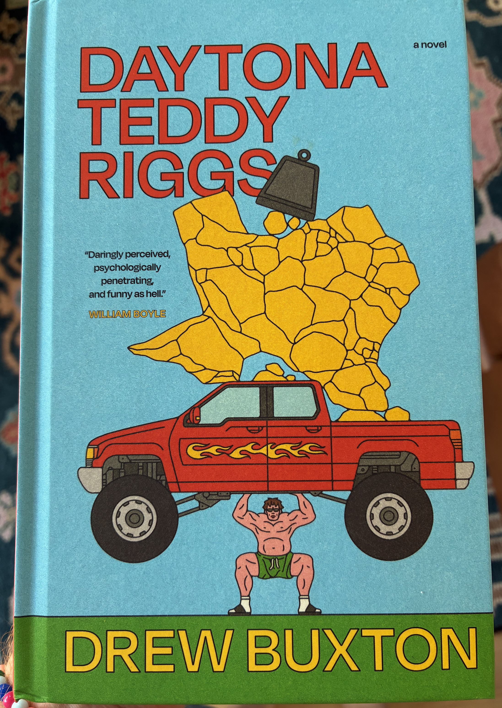
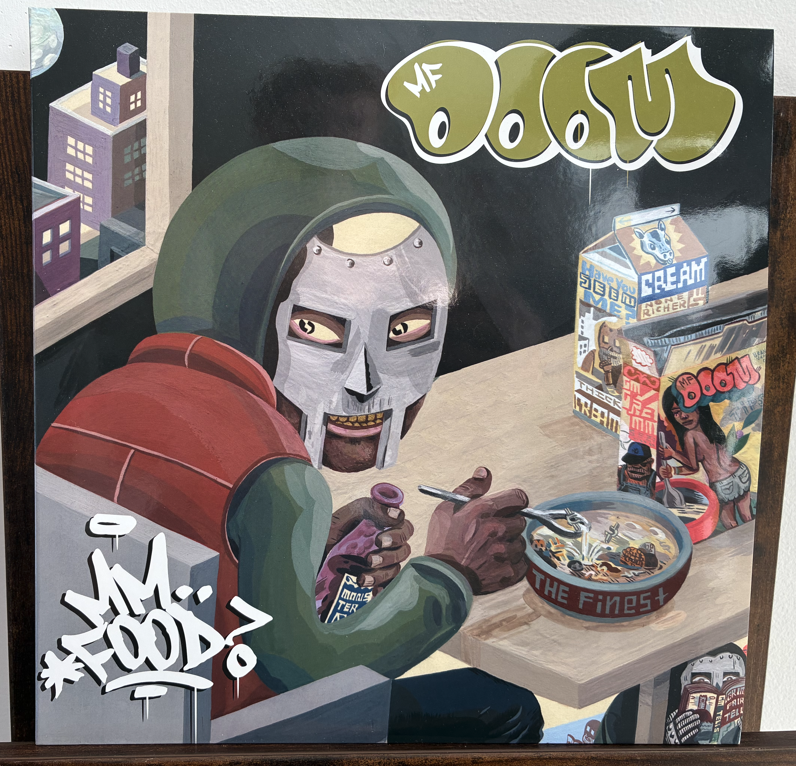
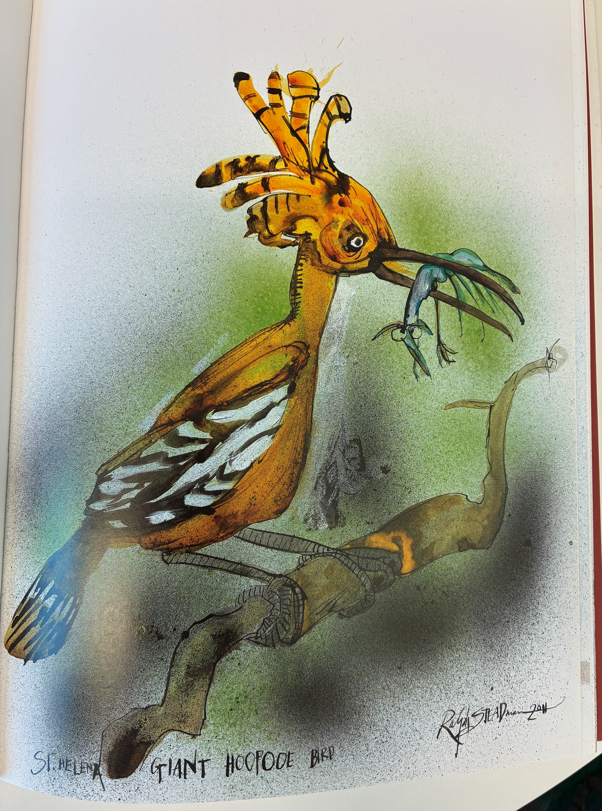

  <!-- Book section -->
  

    <h1>On the nightstand</h1>
    
    

      My good friend's debut novel full of Teddy exercising poor judgement.
    

  

  <!-- Music section -->
  

    <h1>On rotation</h1>
    
    

      A nutritious fifth installment from rap’s supervillain. ALL CAPS when you spell the man’s name.
    

  

  <!-- Boid section -->
  

    <h1>BOID OF THE MONTH</h1>
    
    

      Here's Mr. Hoopoe looking smug and secure with his catch - a resigned, pitiful creature. But extinction awaits you, dear Hoopoe.
    

  






