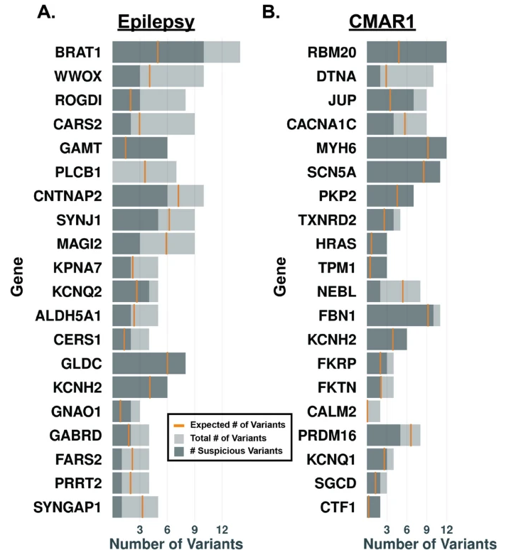

In an especially young cohort of sudden death in young humans, we found excess nonsynonymous variation in both cardiomyopathy and epilepsy-related genes, with the number of epilepsy variants negatively correlated with age of death. These data suggest a polygenic disease liability shared along a neural-cardio axis.
 

 
  
[Download paper here](https://genomemedicine.biomedcentral.com/articles/10.1186/s13073-024-01284-w)

Citation: 1.	4.	Puckelwartz M, Pesce LL, Hernandez EJ, Webster G, Dellefave-Castillo L, Russell MW, Geisler SS, Kearns SD, Karthik FK, Etheridge SP, Monroe TO, Pottinger TD, Kannankeril PJ, Shoemaker BM, Fountain D, Roden DM, MacLeod H, Burns KM, Yandell M, Tristani-Firouzi M, George Jr. A, McNally EM.  The impact of damaging epilepsy and cardiac genetic variant burden in sudden death in the young. Human Molecular Genetics. (2024) PMID: 38229148
