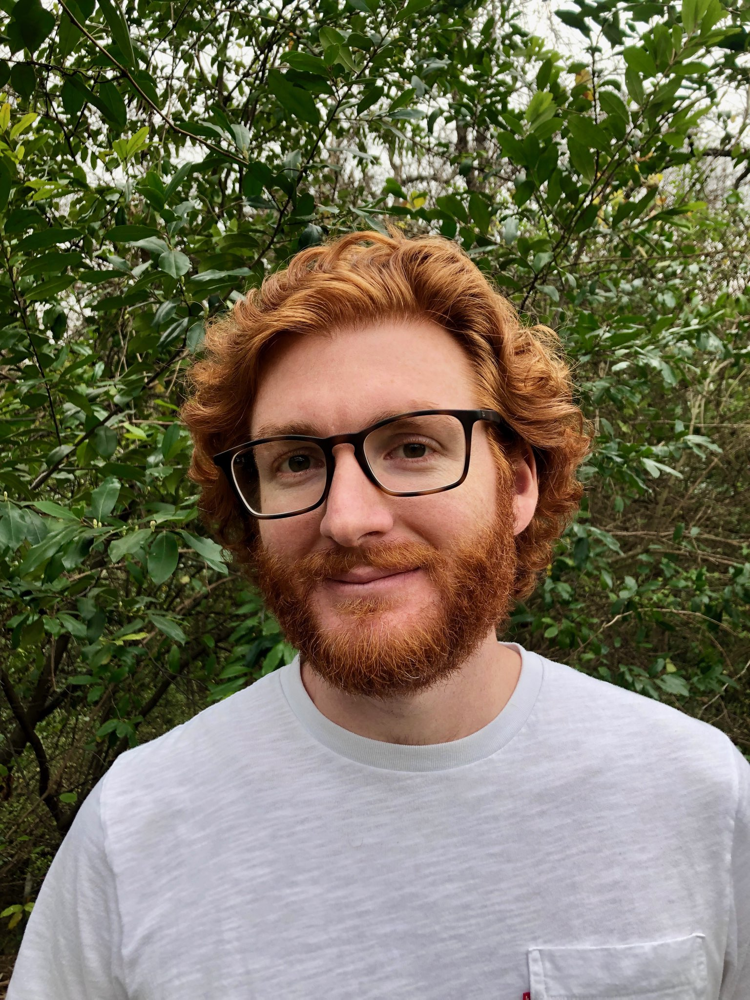

# “We must go and see for ourselves.” —Jacques Cousteau

    

    

        

            - Genetics 
            - Development 
            - Hearts 
        

        

            <strong>I am a geneticist and developmental biologist <a href='https://labs.feinberg.northwestern.edu/mcnally/members/index.html'>in the McNally lab</a> dedicated to understanding how human DNA sequence variation influences cardiac form and function.</strong> The foundation of this work is the observation that we differ in a low proportion of our total DNA sequence content. This fact unites us in a shared humanity that should be celebrated. However, the promise of personalized medicine will only be fulfilled by studying those subtle differences that help shape our individuality.
        

    

{:.center}


