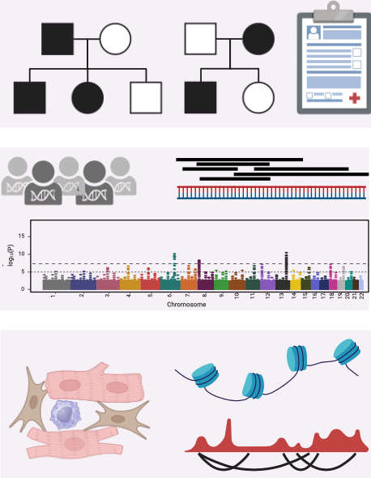
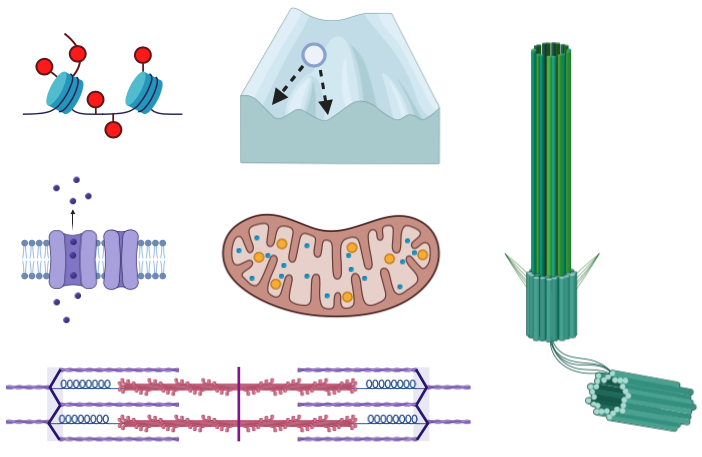

# Research

  
  

    I specialize in testing hypotheses generated from personal and population genetics observations, emphasizing genetic heart diseases and the variable expressivity characteristic of these conditions.

    Complex traits, such as the rhythmic beating of the human heart, emerge through genetic interactions across space and time. While we have made significant progress in resolving how tissues self organize by integrating environmental cues with DNA sequence, we still cannot engineer organs on demand or predict complex phenotypes from genetic sequences alone. Underlying these challenges is our poor understanding of cis and trans genetic interactions. <strong>I am driven by the central ethos that understanding how cumulative genetic variation leads to disease will drive innovation that improves the quality of human life.</strong>

    My work centers around the discovery, validation, and mechanistic interpretation of genetic variation - known as the "variant to function" challenge, V2F. A crucial extension of this approach is the interpretation of variants within the context of modifiers, non-additive interactions, and environmental influences. This topic is acutely relevant as clinical genetics becomes more routine, especially in diverse populations and the emerging role of polygenic inheritance. In my view, multi-allelic predictive models informed by molecular phenotypes will revolutionize the prevention and treatment of disease. My general strategy is organized into three types of projects:

  

# Approach

  

    <ul>
      <li><strong>Statistical inference to identify candidate variants.</strong> Rationally designed drugs with a strong basis in human genetics have repeatedly been proven to be more likely to gain FDA approval. Therefore, I focus my attention on discovering novel genetic components of disease. The goal is to identify highly penetrant variants passed down within families, and separately, to look for inflation of common variants in more common diseases. I am especially interested in how rare and common genetic variants interact to modify disease, and how cumulative genetic burden amounts to a continuum of causality.</li>
       
    </ul>
  

  
  

    
  

  
  

    
  

  

    <ul>
     <li><strong>Testing the pathogenicity of those candidates.</strong> Statistical inference is usually not enough to characterize novel genetic variation. Therefore, an important component is the validation of candidate alleles using engineered human tissues or animal proxies, ideally using complementary models to identify convergent lines of evidence.</li>
       
    </ul>
  

  
 

  <ul>
   <li><strong>Using that knowledge to more clearly understand pathomechanisms.</strong> Once a variant's effect is established, the next step is to understand why. Even pathogenic variants within the same gene can have divergent molecular consequences. Therefore, in order to understand the basis of disease, it is critical to understand the direct molecular consequences stemming from mutation.</li>
  </ul>

  

    
  






