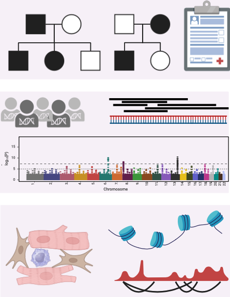
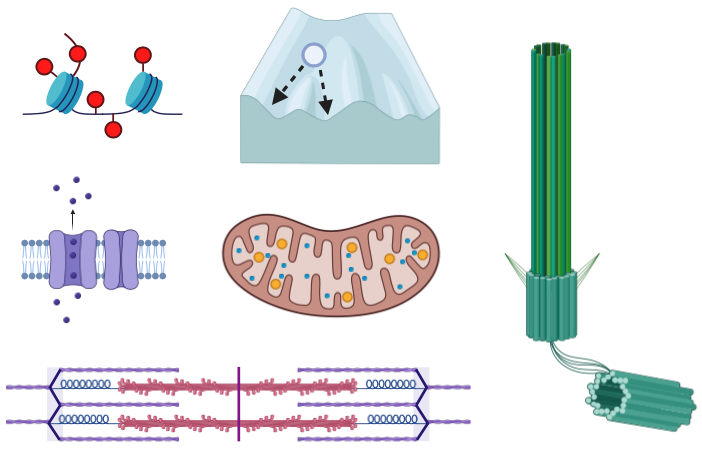

# Research

  
  

  <strong>The LXCG mission is to improve patient outcomes by defining how genetic variation influences cardiac form and function.</strong>
  We specialize in testing hypotheses generated from genetic observations in individual patients and human populations, with an emphasis on inherited heart diseases and their variable outcomes.

  Complex traits, including the rhythmic beating of the human heart, emerge from genetic interactions that unfold across space and time. Although we have made substantial progress in understanding how tissues self-organize by integrating environmental signals with DNA sequence, we still cannot reliably predict complex phenotypes from genetic information or engineer organs on demand. Meeting these challenges will require a deeper understanding of how genetic variants interact both locally and across the genome. <strong>Our work is guided by a central ethos that understanding the cumulative effects of genetic variation will lead to better ways to predict, prevent, and treat disease.</strong>

    Our research spans the discovery of genetic variants, the evaluation of their biological and clinical significance, and the investigation of the mechanisms through which they influence disease. We study how these effects depend on genomic background and environmental exposures, helping explain why individuals with similar disease-associated variants can experience very different outcomes. This work is increasingly important as genetic testing becomes a routine part of clinical care. Realizing its full potential will require predictive models that reflect human genetic diversity, integrate the effects of multiple variants, and incorporate molecular phenotypes. We believe such models could transform the prevention and treatment of cardiovascular disease. Our research is organized into three interconnected areas:

  

# Approach

  

    <ul>
      <li> <strong>Identifying candidate variants through statistical inference.</strong>
        Experimental therapies supported by human genetic evidence are more likely to progress to the clinical. We therefore use family- and population-based genetic analyses to discover variants that contribute to cardiovascular disease. We seek both rare, highly penetrant variants that segregate within families and common variants associated with complex forms of disease. We are particularly interested in how rare and common variants interact, and how their cumulative effects produce a continuum of genetic risk. </li>
       
    </ul>
  

  
  

    
  

  
  

    <video 
  autoplay 
  loop 
  muted 
  playsinline
  style="width: 400px; height: 200px; margin-right: 20px; object-fit: cover;"
>
  <source src="EHT_copy.mp4" type="video/mp4">
</video>
  

  

    <ul>
     <li><strong>Testing the pathogenicity of those candidates.</strong> Statistical inference alone is rarely sufficient to establish the biological or clinical significance of a newly identified variant. Therefore, we test candidate variants in engineered human tissues and animal models, using complementary experimental systems to determine their effects and seek convergent evidence of pathogenicity.</li>
       
    </ul>
  

  
 

  <ul>
   <li><strong>Using that knowledge to more clearly understand pathomechanisms.</strong>  Once the effect of a variant has been established, we investigate how it alters molecular and cellular function. Even pathogenic variants within the same gene can produce distinct consequences. Defining these consequences helps us understand the basis of disease and may reveal opportunities for more precise treatments.</li>
  </ul>

  

    
  






